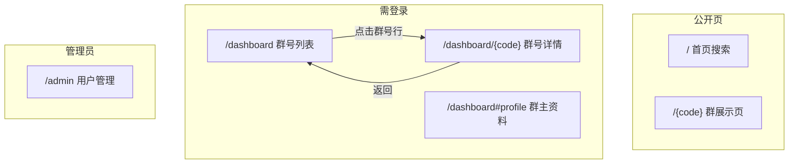
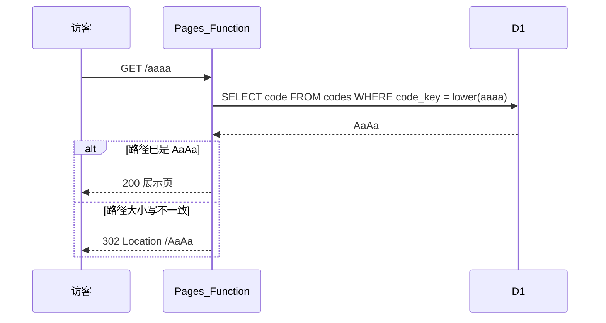

# 群号 qunhao v3 调整方案

> 版本：v3 规划文档  
> 基于：v2 已上线功能（5 位群号、二维码 A/B/C、群主资料、主页搜索）  
> 目标：重构控制台信息架构、新增管理员与高级会员体系

---

## 一、需求对照总览

| # | 需求 | v2 现状 | v3 目标 |
|---|------|---------|---------|
| 1 | 控制台列表页重排 | 单页堆叠：二维码预览 + 分享框 + 按钮，布局拥挤 | 列表只显示摘要信息 + 状态色 + 操作入口 |
| 2 | 群号详情页 | 所有操作挤在 `/dashboard` 单页 | 独立路由 `/dashboard/{code}` |
| 3 | 新建群后 UI | 列表含「下载永久二维码」，易混淆 | 新建后仅引导「上传群二维码」 |
| 4 | 首页搜索框 | 已设 52px 高度，线上仍显矮 | 输入框与按钮严格等高、圆角一致 |
| 5 | 管理员体系 | 无 | Admin 后台 + 高级会员自定义群号 |

---

## 二、信息架构调整

### 2.1 页面结构（控制台）



### 2.2 `/dashboard` 列表页（需求 1）

**设计原则**：一屏看清所有群号状态，不做二维码预览、不展示分享链接。

#### 布局结构

```
┌─────────────────────────────────────────────────────────┐
│  我的群号 (2/5)                          [+ 新建群号]   │
├─────────────────────────────────────────────────────────┤
│  群号      群名称           二维码状态        操作       │
│  ─────────────────────────────────────────────────────  │
│  71492    HDR 技术交流群    ● 2 天前更新     [更新][删除]│  ← 绿色
│  85153    飞书运营群        ● 4 天前更新     [更新][删除]│  ← 黄色
│  18801    闲置群            ○ 未上传         [更新][删除]│  ← 灰色
│  63035    老群              ● 12 天前更新    [更新][删除]│  ← 红色
├─────────────────────────────────────────────────────────┤
│  群主资料（折叠区或锚点 #profile，保持 v2 能力）         │
└─────────────────────────────────────────────────────────┘
```

#### 列表字段说明

| 列 | 内容 | 交互 |
|----|------|------|
| 群号 | 5 位数字（或高级会员自定义码） | **点击整行或群号** → 跳转 `/dashboard/{code}` |
| 群名称 | 创建时填写，**不可编辑** | 仅展示 |
| 二维码状态 | 见下方状态规则 | 仅展示 |
| 操作 | 「更新」「删除」 | 见下方 |

#### 二维码状态色规则（基于 `updated_at`）

| 条件 | 显示 | 颜色 |
|------|------|------|
| `updated_at` 为空 | `未上传` | 灰色 `#999` |
| 距今 ≤ 3 天 | `N 天前更新` / `今天更新` | 绿色 `#07C160` |
| 3 天 < 距今 ≤ 5 天 | `N 天前更新` | 黄色 `#F5A623` |
| 距今 > 5 天 | `N 天前更新` | 红色 `#E5484D` |

> 计算方式：`Math.floor((Date.now() - updated_at) / 86400000)` 得天数；前端与 API 均可计算，建议 API 返回 `statusLevel: 'none' | 'green' | 'yellow' | 'red'` 保持一致。

#### 操作按钮

| 按钮 | 行为 |
|------|------|
| **更新** | 等同 v2「上传/替换二维码」：隐藏 file input → 选图 → 自动解码 B → 重绘 C → 上传 |
| **删除** | 二次确认 → 调用 `DELETE /api/codes/{code}` → 删除 D1 记录 + R2 全部对象 → 刷新列表 |

**删除范围（R2）**：
- `qr-a/{code}.png`
- `qr-c/{code}.png`
- `pages/{code}.html`

#### 明确不做的事（列表页）

- 不显示二维码图片（C 或 A）
- 不显示分享链接复制框
- 不提供「下载永久二维码」
- 不允许修改群名称或群号

---

### 2.3 `/dashboard/{code}` 详情页（需求 2）

**路由**：`https://qunhao.net/dashboard/71492`

#### 布局结构

```
┌──────────────────────────────────────────┐
│  ← 返回列表                              │
│                                          │
│  群号 71492          [微信群]            │
│  HDR 技术交流群                          │
│                                          │
│  ┌──────────────┐                        │
│  │  二维码 C     │  （已上传时显示）       │
│  │  或占位图     │                        │
│  └──────────────┘                        │
│                                          │
│  分享                                     │
│  ├ 直链        https://qunhao.net/71492  [复制] │
│  ├ 图片直链    https://qunhao.net/i/71492 [复制] │
│  └ 分享文字    群号 71492 Qunhao.net      [复制] │
│                                          │
│  [上传/替换群二维码]  [下载永久二维码 A]   │
│  [删除群号]                               │
│                                          │
│  元信息：最后更新、平台、创建时间          │
└──────────────────────────────────────────┘
```

#### 操作说明

| 操作 | 显示条件 | 说明 |
|------|----------|------|
| 上传/替换群二维码 | 始终 | 单步上传（v2 逻辑不变） |
| 下载永久二维码 A | **仅 `updated_at` 非空时** | 下载 `/a/{code}`；未上传前不显示，避免与「上传群码」混淆 |
| 删除群号 | 始终 | 同列表页删除逻辑 |
| 分享三件套 | 始终（直链始终有效；图片链未上传时标注「上传后生效」） | 从列表页迁移至此 |

#### 路由实现方案（推荐）

Cloudflare Pages 静态托管下，`/dashboard/71492` 无法仅靠 `dashboard.html` 命中，需二选一：

**方案 A（推荐）**：Pages Function 服务详情页 HTML

```
functions/dashboard/[code].ts   → GET 返回详情页 HTML（SSR 注入 code）
public/dashboard.html           → GET /dashboard 列表页
```

`_routes.json` 调整：
- 排除 `/dashboard`（列表静态页）
- **不排除** `/dashboard/*`（交给 Function）

**方案 B**：单页应用（一个 `dashboard.html`，JS 解析 `location.pathname`）

- 优点：改动小
- 缺点：URL `/dashboard/71492` 需 Function 将所有 `/dashboard/*` rewrite 到同一 HTML，或全部走 Function

**本方案采用方案 A**：列表静态、详情 Function SSR，SEO 与首屏更清晰。

---

### 2.4 新建群号流程调整（需求 3）

#### 当前问题

v2 在列表卡片中同时出现「上传群二维码」和「下载永久二维码」，用户新建后尚未上传群码，却可下载二维码 A，容易误以为已配置完成。

#### v3 调整

| 阶段 | 界面 | 可见操作 |
|------|------|----------|
| 创建完成 → 回到列表 | 列表新增一行，状态「未上传」灰色 | 仅「更新」「删除」 |
| 点击群号进入详情 | 占位「请上传群二维码」 | **仅**「上传/替换群二维码」 |
| 首次上传成功后 | 详情页显示二维码 C | 出现「下载永久二维码 A」+ 分享区完整可用 |

创建面板本身不变（8 选 1 + 群名称 + 自动生成二维码 A 存 R2），只是 **不在 UI 任何位置提示下载 A**，直到用户完成首次群码上传。

---

### 2.5 首页搜索框修复（需求 4）

#### 问题分析

v2 已设置 `height: 52px`，但全局样式中 `input[type="email"]` 等规则可能未覆盖 `type="text"` 的搜索框；部分浏览器对 `input` 默认 `box-sizing: content-box` 导致「视觉高度」小于按钮；`line-height` 与 `height` 叠加也可能造成错位。

#### 修复方案

```css
.search-box {
  display: flex;
  align-items: stretch;
  gap: 10px;
  max-width: 420px;
  margin: 32px auto 0;
}

.search-box input[type="text"],
.search-box button {
  box-sizing: border-box;
  height: 52px;
  min-height: 52px;
  border-radius: 12px;
  font-size: 18px;
  line-height: 1;
}

.search-box input[type="text"] {
  flex: 1;
  padding: 0 16px;
  border: 1.5px solid var(--border);
  /* 去除浏览器默认外观差异 */
  -webkit-appearance: none;
  appearance: none;
}

.search-box button {
  padding: 0 24px;
  border: none;
  flex-shrink: 0;
}
```

同步修改页面：`index.html`、`intro.html`、`404.html`（均含搜索框）。

#### 搜索规则扩展（配合高级会员）

| 用户类型 | 群号格式 | 首页搜索 |
|----------|----------|----------|
| 普通用户 | 5 位数字 10000–99999 | `^\d{5}$` |
| 高级会员 | 3–10 位字母数字 | `^[a-zA-Z0-9]{3,10}$` |

首页搜索改为：**3–10 位字母或数字** 均可提交；提交后先查 `code_key`，若存在则跳转至**规范 URL**（如输入 `aaaa` → `https://qunhao.net/AaAa`）；纯 5 位数字仍兼容。

---

## 三、管理员与高级会员（需求 5）

### 3.1 角色定义

| 角色 | 标识 | 权限 |
|------|------|------|
| 普通用户 | `user`（默认） | 最多 5 个群号；5 位随机数字 8 选 1；不可改群号/群名 |
| 高级会员 | `premium` | 在普通权限基础上，**创建时可自定义群号**（3–10 位字母数字） |
| 管理员 | `admin` | 访问 `/admin`；查看全部用户；将用户提升为 `premium` |

> 管理员本身可同时是 `premium`；用单字段 `role TEXT` 枚举：`user` | `premium` | `admin`，管理员默认拥有 premium 能力。

### 3.2 数据库变更（schema v3）

```sql
-- users 表新增
ALTER TABLE users ADD COLUMN role TEXT NOT NULL DEFAULT 'user';
-- role IN ('user', 'premium', 'admin')

-- codes 表约束调整（需重建表或迁移）
-- 原：CHECK(length(code) = 5)
-- 新：普通用户 code 为 5 位数字；高级会员 code 为 3-10 位 [a-zA-Z0-9]
-- SQLite 难以表达「按用户角色不同约束」，改由应用层校验 + 去掉严格 CHECK，仅保留 PRIMARY KEY

CREATE TABLE codes (
  code TEXT PRIMARY KEY,              -- 创建时原样保存，如 AaAa（规范 URL 形态）
  code_key TEXT NOT NULL UNIQUE,      -- 查重键：自定义码 = lower(code)；数字码 = code
  user_id TEXT NOT NULL REFERENCES users(id),
  name TEXT NOT NULL,
  platform TEXT,
  group_url TEXT,
  updated_at INTEGER,
  created_at INTEGER NOT NULL,
  is_custom INTEGER NOT NULL DEFAULT 0  -- 1=高级会员自定义码
);

CREATE INDEX idx_codes_key ON codes(code_key);
```

### 3.3 自定义群号规则（高级会员）

| 规则 | 说明 |
|------|------|
| 长度 | 3–10 个字符 |
| 字符集 | `a-z` `A-Z` `0-9` |
| 创建时大小写 | **按用户输入原样保存**（如 `AaAa`、`HDRvip`），可随意混用大小写 |
| 唯一性（查重） | **大小写不敏感**：`AaAa` 与 `aaaa`、`AAAA` 视为同一群号，不可重复注册 |
| 规范 URL | 对外永久链接始终使用创建时保存的 `code` 字段（如 `https://qunhao.net/AaAa`） |
| 保留字 | 禁止与系统路由冲突（**保留字比对亦大小写不敏感**）：`api` `admin` `dashboard` 等 |
| 普通用户 | 仍从 8 个随机 5 位数字中选，逻辑不变（纯数字无大小写问题） |

#### 大小写策略示意

```
用户创建群号：AaAa
  ↓
D1 写入：
  code     = "AaAa"    ← 规范形态，用于所有对外链接与展示
  code_key = "aaaa"    ← 仅用于唯一性查重

访问 qunhao.net/aaaa   → 302 跳转 → qunhao.net/AaAa
访问 qunhao.net/AAAA   → 302 跳转 → qunhao.net/AaAa
访问 qunhao.net/AaAa   → 200 直接展示（已是规范 URL）
```

#### 查重与可用性检查

- `GET /api/codes/check?code=AaAa`：将输入转为 `code_key = lower(code)` 查 `codes.code_key`
- 若已存在且 `code` 为 `AaAa`，则返回「已被占用」
- 若用户输入 `aaaa` 检查，同样命中 `code_key = aaaa`，提示不可用
- R2 对象 key 统一使用规范 `code`（`pages/AaAa.html`、`qr-a/AaAa.png`），**不使用**小写路径

创建 UI 差异：

```
普通用户：  [8 个候选数字按钮] + 群名称
高级会员：  [自定义群号输入框] + [检查可用] + 群名称
            输入框保留用户大小写（如 AaAa），检查可用时大小写不敏感
            或保留随机 5 位作为可选项（「使用随机群号」切换）
```

### 3.3.1 规范 URL 跳转（全站大小写不敏感访问）

**原则**：链接访问**不限制大小写**；若路径中的群号与库中 `code` 大小写不一致，**302 跳转**至创建时确定的规范 URL。

| 场景 | 请求路径 | 行为 |
|------|----------|------|
| 公开展示页 | `GET /aaaa` | 查 `code_key` → 命中 `AaAa` → `302 /AaAa` |
| 控制台详情 | `GET /dashboard/aaaa` | `302 /dashboard/AaAa` |
| 图片直链 | `GET /i/aaaa` | `302 /i/AaAa` |
| 永久码 A | `GET /a/aaaa` | `302 /a/AaAa` |
| 群主页 | `GET /owner/aaaa` | `302 /owner/AaAa` |
| 首页搜索 | 输入 `aaaa` 提交 | 前端或后端跳转至 `/{canonicalCode}` |



**实现要点**：

```typescript
// src/lib/codes.ts
function toCodeKey(code: string): string {
  return /^[1-9]\d{4}$/.test(code) ? code : code.toLowerCase();
}

async function resolveCanonicalCode(db: D1Database, input: string): Promise<string | null> {
  const row = await db.prepare('SELECT code FROM codes WHERE code_key = ?')
    .bind(toCodeKey(input)).first<{ code: string }>();
  return row?.code ?? null;
}

function redirectIfCaseMismatch(request: Request, canonical: string, pathPrefix: string): Response | null {
  const segment = new URL(request.url).pathname.slice(pathPrefix.length);
  if (segment !== canonical) {
    return Response.redirect(new URL(pathPrefix + canonical, request.url).toString(), 302);
  }
  return null;
}
```

- 分享链接、二维码 A 内容、控制台复制框：一律输出**规范 URL**（`https://qunhao.net/AaAa`）
- 预渲染 HTML、`og:url` 等元数据同样使用规范形态

### 3.4 Admin 管理页 `/admin`

#### 访问控制

- 仅 `role = 'admin'` 可访问
- 非管理员访问 → 403 或重定向首页
- 首个管理员：部署时通过 `wrangler secret put ADMIN_EMAIL` 指定邮箱，该用户注册/登录后自动提升为 `admin`（一次性脚本或注册钩子）

#### 页面功能

```
┌────────────────────────────────────────────────────────────┐
│  用户管理                                    [退出登录]    │
├────────────────────────────────────────────────────────────┤
│  邮箱              角色        群号数   注册时间    操作    │
│  ────────────────────────────────────────────────────────  │
│  a@example.com     普通用户     2      2026-06-01  [升为高级会员] │
│  b@example.com     高级会员     5      2026-06-05  [降为普通]     │
│  c@example.com     管理员       1      2026-06-10  —              │
└────────────────────────────────────────────────────────────┘
```

#### API 设计

| 路由 | 方法 | 权限 | 说明 |
|------|------|------|------|
| `/api/admin/users` | GET | admin | 分页列出用户（email, role, codeCount, createdAt） |
| `/api/admin/users/{id}` | PATCH | admin | `{ role: 'premium' \| 'user' }` 升降级 |
| `/api/codes/check` | GET | premium | `?code=AaAa` 检查可用（大小写不敏感查重，返回规范形态提示） |

中间件：`_middleware.ts` 或各 admin 路由内校验 session + `users.role`。

### 3.5 公开展示路由适配

路径段校验（**接受任意大小写**）：

```typescript
function isPublicCodeSegment(segment: string): boolean {
  if (/^[1-9]\d{4}$/.test(segment)) return true;                    // 普通 5 位数字
  if (/^[a-zA-Z0-9]{3,10}$/.test(segment) && !isReserved(segment)) return true;
  return false;
}

function isReserved(segment: string): boolean {
  const RESERVED = ['api','admin','dashboard','login','register','intro','owner','i','a'];
  return RESERVED.includes(segment.toLowerCase());
}
```

处理流程（`functions/[code].ts` 等）：

1. 校验 `segment` 格式合法
2. `resolveCanonicalCode(db, segment)` 按 `code_key` 查找
3. 未找到 → 302 `/intro`（与 v2 一致）
4. 找到且 `segment !== canonical` → **302 `/{canonical}`**
5. 找到且大小写一致 → 返回 R2 预渲染页 / 图片等

`isReserved()` 使用 `toLowerCase()` 比对，防止 `qunhao.net/Admin` 等被误注册为群号。

---

## 四、API 变更汇总

### 4.1 新增

| API | 说明 |
|-----|------|
| `DELETE /api/codes/{code}` | 删除群号及 R2 资源 |
| `GET /api/codes/{code}` | 单个群号详情（详情页数据） |
| `GET /api/codes/check?code=` | 高级会员自定义码可用性检查 |
| `GET /api/admin/users` | 管理员用户列表 |
| `PATCH /api/admin/users/{id}` | 修改用户角色 |
| `GET /dashboard/{code}` | 详情页 HTML（Function） |

### 4.2 修改

| API | 变更 |
|-----|------|
| `GET /api/codes` | 列表项增加 `statusLevel`、`daysSinceUpdate`；移除详情级字段冗余 |
| `POST /api/codes` | 支持 `customCode`（premium）；校验保留字 |
| `GET /api/codes/candidates` | 响应增加 `canCustomize: boolean`（是否高级会员） |

### 4.3 不变

- 认证：`/api/auth/*`
- 上传：`POST /api/codes/{code}/upload`（二维码 B→C 流程）
- 群主资料：`/api/profile/*`
- 公开页：`/{code}`、`/i/{code}`、`/a/{code}`、`/owner/{code}`

---

## 五、文件改动清单

| 文件 | 操作 |
|------|------|
| `schema.sql` | v3 迁移：`users.role`、`codes.code_key`（大小写查重）、`codes.is_custom` |
| `public/dashboard.html` | 重写为列表页 |
| `functions/dashboard/[code].ts` | **新增** 详情页 SSR |
| `public/assets/style.css` | 列表表格样式、状态色、搜索框修复 |
| `public/assets/dashboard-detail.js` | **新增** 详情页交互（上传/分享/删除） |
| `public/admin.html` | **新增** 管理页 |
| `functions/api/codes/[code].ts` | **新增** GET 单条 + DELETE |
| `functions/api/codes/check.ts` | **新增** 自定义码检查 |
| `functions/api/admin/users.ts` | **新增** 用户列表与升降级 |
| `functions/_middleware.ts` | **新增** admin 鉴权辅助 |
| `functions/[code].ts` | 扩展公开展示码校验 |
| `src/lib/codes.ts` | 自定义码校验、`code_key` 查重、规范 URL 302、保留字、状态色计算 |
| `public/index.html` 等 | 搜索框 maxlength / 校验扩展 |
| `public/_routes.json` | 排除 `/admin`；`/dashboard` 仅列表 |

---

## 六、实施阶段建议

### 阶段 1：控制台重构（需求 1–4）

1. 搜索框 CSS 修复（全站搜索表单）
2. 列表页 `dashboard.html` 重写
3. 详情页 `functions/dashboard/[code].ts` + 前端脚本
4. `DELETE /api/codes/{code}` + `GET /api/codes/{code}`
5. 新建后 UI：列表/详情均不展示「下载永久二维码」直至首次上传

**验收**：
- [ ] 列表无二维码图、无分享框，行距统一
- [ ] 状态色绿/黄/红/灰正确
- [ ] `/dashboard/{code}` 含全部操作
- [ ] 未上传时无「下载永久二维码」
- [ ] 首页搜索框与按钮等高、圆角一致

### 阶段 2：管理员体系（需求 5）

1. schema v3 迁移 + `ADMIN_EMAIL` 引导
2. Admin 页面 + API
3. 高级会员自定义群号创建流程
4. 公开展示路由与首页搜索扩展

**验收**：
- [ ] 非 admin 无法访问 `/admin`
- [ ] admin 可将用户升为 premium
- [ ] premium 可创建 `AaAa` 等任意大小写自定义码
- [ ] `AaAa` 与 `aaaa` 查重冲突，不可重复创建
- [ ] `qunhao.net/AaAa` 展示页正常；`qunhao.net/aaaa` 自动 302 至 `/AaAa`
- [ ] `/dashboard/aaaa`、`/i/aaaa` 等同理跳转至规范 URL
- [ ] 分享链接复制为创建时大小写（如 `https://qunhao.net/AaAa`）
- [ ] 保留字 `admin` / `Admin` 等被拒绝

---

## 七、风险与说明

| 项 | 说明 |
|----|------|
| 删除不可恢复 | 删除群号后 R2/D1 均清除，需二次确认文案 |
| 群名不可改 | 用户只能删了重建；降低实现复杂度 |
| 自定义码与 5 位数字冲突 | 创建时 `code_key` 全局唯一；建议自定义码禁止纯 5 位数字减少混淆（可选） |
| 大小写跳转链路 | 所有带 `{code}` 的 Function 路由需统一走 `resolveCanonicalCode`，避免遗漏导致 404 |
| 已存在 v2 群号迁移 | 纯数字群号 `code_key = code`；无大小写问题，迁移脚本需回填 `code_key` |
| Admin 引导 | 首个管理员需手动配置 `ADMIN_EMAIL` 或 D1 直接改 role |
| 免费层限额 | 新增 admin 查询为低频；不影响主要瓶颈 |
| 数据库迁移 | v2→v3 需 `db:init:remote` 或增量迁移脚本；**会清空或需备份** |

---

## 八、与 v2 差异小结

```
v2 控制台 = 单页 All-in-One（预览 + 分享 + 操作混在一起）
v3 控制台 = 列表（摘要） + 详情（全部操作）

v2 新建后 = 可立即下载永久二维码 A（易混淆）
v3 新建后 = 仅引导上传群码；下载 A 在首次上传后出现

v2 用户体系 = 人人平等，5 位随机码
v3 用户体系 = 普通 / 高级会员（自定义码）/ 管理员
```

---

*文档结束。确认后可按「阶段 1 → 阶段 2」顺序实施。*
